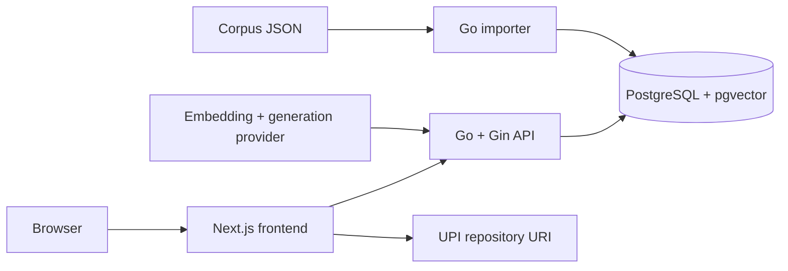

# SearchLens

SearchLens is a learning project for discovering Universitas Pendidikan Indonesia (UPI) thesis metadata and available abstracts. Chapter 2 adds pgvector hybrid retrieval, related records, corpus trends, and optional abstract-grounded synthesis. It never accesses restricted PDFs or chapter-level content.

## Architecture



The browser calls the API directly. The API validates search and filter inputs and queries PostgreSQL through `pgx`. A separate command in the same Go module imports the checked-in JSON files idempotently by repository URI.

## Requirements

- Docker with Compose
- [GVM](https://github.com/moovweb/gvm) with Go 1.27.1
- Node.js 20.9+ and npm

## Run locally

Select Go with GVM, then create the server environment:

```sh
gvm install go1.27.1 -B
gvm use go1.27.1
make env
```

Set `POSTGRES_PASSWORD` in the generated `.env`. Start PostgreSQL and import the corpus:

```sh
make db-up
make import
```

Start the API:

```sh
make api
```

In another terminal, install and start the frontend:

```sh
cd apps/frontend
cp .env.local.example .env.local
npm ci
npm run dev
```

Open <http://localhost:3000>. The API listens on <http://localhost:8080> by default. Stop PostgreSQL with `make db-down`.

## Checks

Audit the corpus and its fixed retrieval evaluation set:

```sh
node scripts/audit-corpus.mjs
node --test scripts/*.test.mjs
```

Run backend checks with the active GVM version:

```sh
make backend-test
```

Set `TEST_DATABASE_URL=${DATABASE_URL}` in `.env` to include PostgreSQL integration and retrieval evaluation tests.

Run frontend checks:

```sh
cd apps/frontend
npm test
npm run lint
npx tsc --noEmit
npm exec -- next build --webpack
```

With the API running against an imported corpus, measure search latency:

```sh
node scripts/benchmark-search.mjs
```

An alternate API base URL may be supplied as the first argument.

For Supabase PostgreSQL deployment, migration, least-privilege runtime access, verified TLS, backup, restore, and remote timing instructions, see [Chapter 2 deployment notes](docs/chapter-2/DEPLOYMENT.md).

## Chapter 2 Phase 0

With the expanded corpus in `docs/repository-data`, reproduce its audit and lexical baseline:

```sh
rtk node scripts/audit-corpus.mjs docs/repository-data docs/chapter-2/corpus-audit.json
rtk node scripts/evaluate-search.mjs http://localhost:8080 docs/chapter-2/evaluation.json docs/chapter-2/lexical-baseline.json
```

After manually reviewing the judged set, configure `OPENROUTER_API_KEY` and compare the locked 1,536-dimension embedding candidates:

```sh
rtk node scripts/benchmark-embeddings.mjs
```

Cached vectors stay under ignored `.cache/embeddings`; the benchmark report records model usage, cost, latency, retrieval metrics, and winner.

## Chapter 2 operation

Set `OPENROUTER_API_KEY` and the database URL in ignored `.env`. The locked models are `google/gemini-embedding-2` (1,536 dimensions) and the configured generation model; model identifiers, token limits, and timeout remain server-side configuration. Apply migrations, import, and embed with:

```sh
make migrate
make import
make embed
```

With the API running, reproduce the release retrieval evidence:

```sh
node scripts/evaluate-search.mjs http://localhost:8080 docs/chapter-2/evaluation.json docs/chapter-2/release-hybrid.json hybrid
node scripts/verify-exact-titles.mjs http://localhost:8080 docs/chapter-2/release-exact-titles.json
node scripts/evaluate-synthesis.mjs http://localhost:8080 docs/chapter-2/synthesis-results.json
```

Generated answers are optional and grounded only in retrieved available abstracts. Citations link to the original repository URI; missing abstracts produce insufficient evidence rather than invented content. Retrieval and deployment evidence is recorded in [the Chapter 2 plan](docs/chapter-2/PLAN.md); public-deployment blockers are in [Tech Debt](docs/chapter-2/TECH_DEBT.md).

For rollback, restore the previous server-side `DATABASE_URL`; no frontend configuration changes are needed. Do not publicly enable synthesis until the documented proxy rate limit and all Tech Debt blockers are resolved.

## Database backup

Create a custom-format PostgreSQL backup:

```sh
docker compose --env-file .env exec -T db sh -c 'pg_dump --username "$POSTGRES_USER" --dbname "$POSTGRES_DB" --format=custom' > searchlens.dump
```

Restore replaces database objects and data. Stop the API first, then run:

```sh
docker compose --env-file .env exec -T db sh -c 'pg_restore --username "$POSTGRES_USER" --dbname "$POSTGRES_DB" --clean --if-exists --no-owner' < searchlens.dump
```

## Data and license

Original source code and project documentation are licensed under the [MIT License](LICENSE), copyright 2026 Khalifa Esha.

Files under `docs/repository-data/` are excluded from the MIT License. They contain publicly visible metadata and abstracts obtained from the [UPI Repository](https://repository.upi.edu/). Rights in those records remain with UPI and their respective authors; this project grants no rights to reuse them. Each record keeps its authoritative repository URI.

SearchLens is an independent learning project and is not affiliated with or endorsed by UPI. No restricted full text is included.
