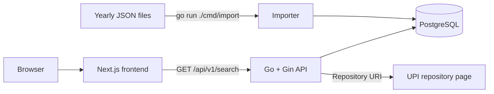

# Chapter 1 Architecture

## 1. Decision

Build one Go/Gin service backed by one PostgreSQL database. PostgreSQL full-text search is sufficient for the current 820-record starter corpus and can comfortably handle later degree-program additions. It provides the baseline that later semantic retrieval must beat.



The importer and API live in the same Go module and share the database package and record model. They are separate commands, not separate services.

## 2. Runtime stack

- Go 1.27
- Gin 1.12
- PostgreSQL
- `pgx/v5` with `pgxpool`
- Go standard library for configuration, logging, JSON, dates, shutdown, and tests
- Docker Compose for local PostgreSQL

No ORM or query generator is needed for the initial schema and small query surface.

## 3. Proposed backend layout

```text
apps/backend/
├── cmd/
│   ├── api/main.go
│   └── import/main.go
├── internal/
│   ├── httpapi/httpapi.go
│   ├── records/records.go
│   └── store/postgres.go
├── migrations/001_init.sql
├── go.mod
└── README.md
```

Keep SQL beside the store methods until repetition proves a separate query layer is useful.

## 4. Data model

```sql
CREATE TABLE documents (
    id              bigint GENERATED ALWAYS AS IDENTITY PRIMARY KEY,
    uri             text NOT NULL UNIQUE,
    source_year     smallint NOT NULL CHECK (source_year BETWEEN 1900 AND 2100),
    title           text NOT NULL,
    abstract        text,
    authors         text[] NOT NULL DEFAULT '{}',
    item_type       text,
    subjects        text,
    divisions       text,
    depositing_user text,
    date_deposited  timestamptz,
    search_text     text NOT NULL,
    search_vector   tsvector GENERATED ALWAYS AS
                    (to_tsvector('simple', search_text)) STORED,
    imported_at     timestamptz NOT NULL DEFAULT now()
);

CREATE INDEX documents_search_idx ON documents USING gin (search_vector);
CREATE INDEX documents_year_idx ON documents (source_year);
CREATE INDEX documents_item_type_idx ON documents (item_type);
```

The importer constructs `search_text` with repeated title text followed by authors, subjects, divisions, and abstract. This gives titles more influence without adding a ranking subsystem. The `simple` text-search configuration is used because the corpus contains Indonesian, English, names, and technical terms.

`date_deposited` is parsed from the source layout `02 Jan 2006 15:04`. Invalid non-empty dates reject that record rather than silently changing their meaning.

## 5. Search flow

1. Gin binds and validates query parameters.
2. The store converts the query with `websearch_to_tsquery('simple', $1)`.
3. PostgreSQL applies full-text matching and optional filters.
4. Relevance uses `ts_rank_cd`; alternate sorts use normalized title or deposit date.
5. A count query supplies pagination metadata.
6. Gin returns a stable JSON response.

Relevance ties use title and URI for stable pagination. Title sort is case-insensitive ascending. Date sort is newest first with missing dates last. The filter endpoint reads distinct global values directly from `documents`; it does not depend on a search query.

User values are always passed as pgx parameters. Sort columns are selected from a fixed server-side allowlist and never interpolated from arbitrary input.

## 6. Import flow

1. Recursively discover files matching `repository_*_data.json` under the configured corpus directory.
2. Extract the four-digit year from each filename.
3. Decode the JSON array with typed Go structs.
4. Validate required `title` and `uri` fields without assuming a degree program.
5. Normalize whitespace and empty optional strings.
6. In one transaction per file, upsert each record on `uri`.
7. Commit and print counts; roll back the file on failure.

The importer reads files directly from disk. New degree programs require only same-schema JSON files whose `divisions` value identifies the program. Upload endpoints, per-program adapters, and job queues are outside Chapter 1.

## 7. HTTP behavior

Routes:

- `GET /healthz`
- `GET /readyz`
- `GET /api/v1/search`
- `GET /api/v1/filters` for available years, divisions, and item types

Cross-cutting behavior:

- Gin recovery middleware.
- Structured request logs with method, route, status, duration, and request ID.
- Server read, write, idle, and shutdown timeouts.
- CORS limited to the configured frontend origin in development; same-origin routing is preferred in deployment.
- Consistent error body: `{ "error": { "code": "invalid_query", "message": "..." } }`.

## 8. Deployment

Local development runs the frontend, Go service, and PostgreSQL through documented commands. Production uses one stateless Go container and a managed PostgreSQL instance or one PostgreSQL container for a small private deployment.

The browser reads the backend origin from `NEXT_PUBLIC_API_URL`; local frontend settings live in `apps/frontend/.env.local` and contain no database credentials.

Only the API receives public traffic. Database credentials remain server-side. The JSON corpus is imported during an explicit release step, not every API startup.

## 9. Verification

- Unit test request validation and date parsing with the standard library.
- Handler test the search response with `httptest`.
- One PostgreSQL integration test verifies import idempotency and search ranking.
- Run `go test ./...` and import all checked-in data before release.

## 10. Chapter 2 seam

Chapter 2 may add an `embedding` column and hybrid retrieval within the same PostgreSQL database. It should preserve this API where possible. An LLM receives only retrieved records and cites their URIs. No vector database, provider framework, or LLM abstraction is added in Chapter 1.
