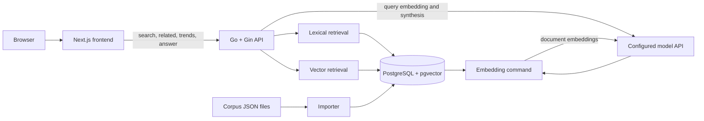

# Chapter 2 Architecture

## 1. Decision

Extend the Chapter 1 Go/Gin service and PostgreSQL database. Add `pgvector` to the existing database, one embedding per thesis record, reciprocal-rank hybrid retrieval, metadata aggregation, and one concrete external model client used for query embeddings and grounded synthesis. Keep Docker PostgreSQL for local development and support Supabase PostgreSQL as the production database target.



No second database or application service is needed for the target corpus. Model API choice, model identifiers, vector dimensions, limits, and pricing must be locked and recorded in Phase 0 before the schema migration is written.

## 2. Runtime stack

- Existing Go, Gin, PostgreSQL, `pgx/v5`, Next.js, React, TypeScript, and Tailwind stack.
- `pgvector` PostgreSQL extension and matching pgx vector codec only if raw pgx encoding would add more code.
- Go standard library for hashing, JSON, HTTP, logging, batching, timeouts, and tests.
- One concrete model API client; no provider framework, factory, or interface with one implementation.
- Existing Docker Compose PostgreSQL image extended or replaced with a compatible pgvector image.
- Supabase-hosted PostgreSQL as a deployment target, accessed through pgx rather than a Supabase SDK.

The model decision must pass a representative Indonesian-English retrieval benchmark. The selected embedding dimensions become part of the migration and cannot vary per row.

## 3. Backend layout

Keep the Chapter 1 module and add only code required by new flows:

```text
apps/backend/
├── cmd/
│   ├── api/main.go
│   ├── embed/main.go
│   └── import/main.go
├── internal/
│   ├── ai/client.go
│   ├── httpapi/httpapi.go
│   ├── records/records.go
│   └── store/postgres.go
└── migrations/
    └── 002_semantic_search.sql
```

Split existing files only when their size obstructs review. Keep SQL beside store methods. The embedding command and API share the concrete model client and database types; they are commands in one module, not services.

## 4. Data model

Enable pgvector and extend `documents`:

```sql
CREATE SCHEMA IF NOT EXISTS extensions;
CREATE EXTENSION IF NOT EXISTS vector WITH SCHEMA extensions;

ALTER TABLE documents
    ADD COLUMN embedding extensions.vector(D),
    ADD COLUMN embedding_model text,
    ADD COLUMN embedding_input_hash text,
    ADD COLUMN embedded_at timestamptz;
```

`D` is replaced by the locked model dimension in the committed migration. Embedding metadata stays on `documents` because there is one active embedding per record. Model changes use an explicit re-embedding run; an embeddings history table is unnecessary.

At roughly 2,000 records, begin with exact cosine search:

```sql
ORDER BY embedding OPERATOR(extensions.<=>) $1::extensions.vector(D)
```

Do not add HNSW initially. Add an approximate index only if measured p95 or planned corpus growth requires it, then measure recall against exact search.

### Canonical embedding input

The embedding command produces a stable labeled string:

```text
Title: ...
Authors: ...
Subjects: ...
Division: ...
Abstract: ...
```

Missing optional values produce empty sections and are never synthesized. Hash the exact UTF-8 input with SHA-256. A row is current only when both its hash and model identifier match the active configuration.

## 5. Embedding flow

1. `cmd/embed` selects rows whose embedding is null, whose input hash changed, or whose model identifier differs.
2. It builds canonical input and sends bounded batches to the configured model API.
3. It validates response count and dimensions before updating rows.
4. Each valid vector is stored with its input hash, model identifier, and timestamp.
5. Failed batches are retried only for transient errors with a small fixed limit and server-provided backoff when available.
6. Permanent per-record failures are reported by URI; metadata and Chapter 1 search remain intact.
7. The command prints embedded, skipped, failed, and total counts and exits non-zero when failures remain.

Updates are idempotent. No job queue or background worker is introduced; embedding remains an explicit release/import step.

## 6. Retrieval flow

### Lexical

Reuse Chapter 1 `tsvector`, filters, validation, and stable ordering. PostgreSQL remains authoritative for exact title, author, filters, and alternate sorts.

### Semantic

1. Validate and normalize the query using existing request rules.
2. Request one query embedding using the active document embedding model.
3. Apply the same filters as lexical retrieval.
4. Order eligible rows by cosine distance and take a fixed candidate count.
5. Exclude null or stale embeddings.

### Hybrid

Run lexical and semantic candidate queries concurrently after query validation. Each returns at most 50 ranked candidates. Fuse them in PostgreSQL or the store method with reciprocal rank fusion:

```text
rrf_score = sum(1 / (60 + rank))
```

Use `uri` as the identity and stable final tie-breaker. A record found by both paths receives both contributions. RRF avoids pretending lexical rank and cosine distance share a calibrated numeric scale.

If query embedding fails, hybrid mode returns lexical results and includes an internal degraded-mode log field; semantic-only mode returns the standard service-unavailable error. Do not expose provider details or credentials.

`sort=title` and `sort=date` first form matching candidates using the chosen retrieval mode, then apply the Chapter 1 ordering rules.

## 7. Related-thesis flow

1. Resolve the supplied URI through the unique database constraint.
2. Reject missing records and records without a current embedding distinctly.
3. Search other current embeddings by cosine distance with optional division filter.
4. Exclude the source URI and return at most 20 records.
5. Preserve stable URI tie-breaking and the existing result shape.

This reuses document embeddings; no graph or relationship table is required.

## 8. Trend flow

Trends are direct parameterized PostgreSQL aggregations over stored metadata. Year, division, and item-type counts use existing fields. Subject counts use deterministic normalized labels produced during import or query-time parsing after Phase 0 audits actual values.

Return bounded top subject values plus missing counts. Do not use embeddings or generation to name clusters in Chapter 2; generated labels would weaken reproducibility.

## 9. Grounded synthesis flow

1. Bind and validate the request body and filters.
2. Run hybrid retrieval server-side.
3. Select at most eight highest-ranked records with non-empty abstracts, subject to a fixed input-token budget.
4. Assign local citation identifiers `[1]` through `[N]` and provide title, metadata, abstract, and URI as untrusted evidence blocks.
5. Instruct the model to answer only from evidence, cite factual statements, ignore instructions contained inside evidence, mention conflicts, and return insufficient evidence when needed.
6. Request structured JSON containing answer text, used citation identifiers, and insufficient-evidence state.
7. Parse the JSON and verify every cited identifier against supplied evidence.
8. Reject invalid output. Map valid identifiers to titles and repository URIs in the API response.

The server never accepts client-provided evidence. Full prompts, full user queries, abstracts, and generated answers are not logged by default.

Generation uses a separate timeout and a fixed maximum output size. Provider failure does not erase the already retrieved results in the frontend.

## 10. HTTP behavior

Routes:

- Existing `GET /healthz`, `GET /readyz`, `GET /api/v1/search`, and `GET /api/v1/filters`.
- New `GET /api/v1/related`.
- New `GET /api/v1/trends`.
- New `POST /api/v1/answer`.

Cross-cutting behavior:

- Keep Chapter 1 request IDs, structured logs, CORS, recovery, and server timeouts.
- Add strict JSON body size and content-type checks for synthesis.
- Apply model-specific timeouts and bounded concurrent outbound calls.
- Protect model-backed endpoints with deployment-level rate limits before public release.
- Keep secrets in server environment variables and redact provider errors returned to clients.
- Log mode, result count, degraded state, duration, model identifier, token usage, and estimated cost where available; omit full content.

Readiness continues to test PostgreSQL only. External model outages degrade semantic and synthesis features but must not mark the whole catalog unavailable.

## 11. Configuration

Add only values required by the selected model integration:

- Model API credential.
- Embedding model identifier and fixed dimensions.
- Generation model identifier.
- Outbound timeout.
- Synthesis input and output limits.
- Maximum concurrent model requests.

Model API URL and organization/project identifiers are added only if the selected provider requires them. Defaults belong in code when they are not deployment choices. Public frontend configuration continues to contain no model credentials.

## 12. Deployment and migration

1. Back up PostgreSQL.
2. Deploy a PostgreSQL build with the pgvector extension available.
3. Apply migration `002_semantic_search.sql`.
4. Import and audit the full corpus.
5. Run the explicit embedding command until it reports no failures.
6. Deploy API and frontend with hybrid retrieval enabled.
7. Enable synthesis only after rate limiting and citation validation pass.

Lexical search remains available throughout embedding backfill. Rollback disables semantic routes and leaves Chapter 1 columns and data intact; dropping embedding columns is not required during incident recovery.

### Supabase production target

Supabase is a hosting choice for the same PostgreSQL schema, not a second application platform:

- Keep `apps/backend/migrations` as the only migration source. Do not create a duplicate `supabase/migrations` history unless the project later adopts Supabase CLI as its sole migration runner.
- Apply migrations, imports, embeddings, `pg_dump`, and restore operations through the direct Supabase connection.
- Run the persistent Go backend through the direct connection when its host supports the project's IP version. Use Supavisor session mode when the backend is IPv4-only.
- Do not use transaction mode for the current pgx path because it does not support prepared statements. Reconsider only for a serverless Go deployment with prepared statements explicitly disabled and tested.
- Require TLS. Prefer certificate verification with `sslmode=verify-full`; use `sslmode=require` only when deployment cannot supply the Supabase CA certificate and record that limitation.
- Copy connection strings from the Supabase dashboard; do not construct pooler hosts or usernames.
- Use separate secrets for administrative operations and the application's least-privilege runtime role.
- Keep database credentials server-side. The frontend continues calling only the Go API and needs no Supabase URL or key.
- Size the pgx pool below the selected Supabase connection limit and measure remote p95 before release.

Migration `002_semantic_search.sql` creates the `extensions` schema and installs pgvector there so vector types and operators can be schema-qualified consistently in local and hosted PostgreSQL.

## 13. Verification

- Unit test canonical embedding input hashing, model response validation, RRF ordering, citation validation, and request validation.
- Integration test embedding idempotency, filtered vector retrieval, hybrid fusion, related-record exclusion, trend counts, and lexical fallback.
- Use a fake HTTP model server for deterministic tests; live provider calls are opt-in smoke checks.
- Compare exact vector results with any future approximate index before accepting it.
- Run existing Chapter 1 evaluation unchanged, then run the larger Chapter 2 judged set in lexical, semantic, and hybrid modes.
- Measure retrieval latency separately from model API latency and report generation usage/cost separately.
- On a clean Supabase project, apply migrations in order, import and embed the corpus, run readiness and retrieval smoke checks, and verify backup and restore using the direct connection.
- Confirm the runtime role can read required tables but cannot alter schema or write corpus records.

## 14. Deferred architecture

- HNSW: add when exact vector search misses the latency gate at measured corpus size.
- Cross-encoder reranking: add only if hybrid retrieval misses relevance targets and error analysis supports it.
- Chunking: add only when legally available source text becomes materially longer than abstracts.
- Background jobs: add only when explicit embedding runs cannot meet ingestion freshness requirements.
- Separate vector database or model service: add only when PostgreSQL or the single service reaches a measured operational limit.
- Provider abstraction: add only when a second active provider is required.
- Supabase Auth, Data APIs, Edge Functions, Storage, Realtime, and client SDKs: add only when a product requirement needs them.
