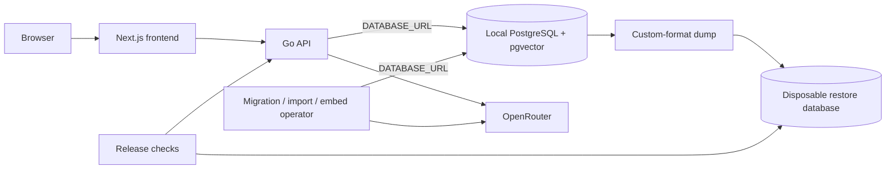

# Chapter 3 Architecture

## 1. Decision

Keep the Chapter 2 application unchanged in shape: one Next.js frontend, one Go/Gin backend, PostgreSQL with pgvector, explicit import and embedding commands, and one OpenRouter client. Chapter 3 adds release evidence and the minimum local operational support needed for clean rebuild, backup, restore, and verification.

No new service, database, search engine, model abstraction, or application feature is required.

## 2. Scope boundary

Chapter 3 accepts only a loopback-bound local database. The release claim ends at reproducible local operation. Hosted deployment is [To Be Discussed](../TECH_DEBT.md).

## 3. Runtime stack

- Existing Next.js, React, TypeScript, Tailwind CSS, Go, Gin, `pgx/v5`, PostgreSQL, and pgvector.
- Existing Docker Compose database image and named volume.
- Existing ordered SQL migrations under `apps/backend/migrations`.
- Existing Go migration, import, embedding, and API commands.
- PostgreSQL native `pg_dump` and `pg_restore` for local operations.
- Existing Node.js evaluation scripts and test runner.

No new dependency is justified.

## 4. Database connection

Chapter 3 keeps the existing local contract: `DATABASE_URL` is used by migration, import, embedding, tests, and API commands. Docker initialization continues using the existing `POSTGRES_DB`, `POSTGRES_USER`, and `POSTGRES_PASSWORD` values.

Keep one local connection path and store its credentials in the ignored `.env` file.

## 5. Local network boundary

PostgreSQL remains bound to `127.0.0.1` by Compose. `sslmode=disable` is permitted only because the connection never leaves the host. If the database is exposed beyond loopback, the Chapter 3 local claim no longer applies and TLS becomes mandatory.

The frontend continues to call only the Go API. It receives no database or model credential.

## 6. Clean build and idempotency

The release flow uses a disposable local database or isolated Compose project, not the maintainer's active database volume:

1. Start an empty pgvector PostgreSQL instance.
2. Apply `001_init.sql` and `002_semantic_search.sql` through `cmd/migrate`.
3. Import the checked-in corpus through `cmd/import`.
4. Generate embeddings through `cmd/embed`.
5. Repeat migration, import, and embedding commands.
6. Record counts and confirm the repeat run changes nothing.

Do not add a migration framework. Two ordered migrations and the existing runner are sufficient.

## 7. Exact-title diagnosis

Treat the 93 failures as an evidence problem before a code problem.

1. Group source records by normalized exact title and identify title collisions.
2. Replay failed queries against lexical search and record returned URIs and ranks.
3. Separate verifier assumptions from retrieval defects and source anomalies.
4. Fix one shared layer only when evidence identifies a defect.
5. Rerun the unchanged evaluation set after any retrieval change.

The verifier must support deterministic pagination for duplicate-title groups. Do not increase result limits or add URI-specific boosts to hide failures.

## 8. Synthesis review data

Reuse `docs/chapter-2/synthesis-results.json` as the captured model-output baseline. Extend or derive a Chapter 3 review artifact containing claim text, cited IDs, support judgment, reviewer note, model usage, latency, and estimated cost.

Keep human judgments separate from runtime response handling. Do not add model-as-judge scoring for the release gate. Citation structure remains validated automatically; factual support remains human-reviewed.

## 9. Backup and restore

Create a custom-format dump from the existing local connection. Restore only into a separate disposable local database or isolated Compose project.

Verification after restore must cover:

- PostgreSQL and pgvector versions;
- migration state and schema availability;
- document and embedding counts;
- API readiness;
- one lexical, semantic, hybrid, related, trend, and synthesis smoke request.

Never use `--clean` against the active release database during verification.

## 10. Measurements and evidence

Store final Chapter 3 evidence under `docs/chapter-3` with stable JSON where scripts already emit JSON and Markdown for reviewer decisions. Record database retrieval separately from provider latency.

Minimum evidence:

- environment and corpus report;
- exact-title classification and final verifier output;
- lexical, semantic, and hybrid evaluation;
- related and trend latency;
- synthesis claim review, usage, cost, and latency;
- backup and restore smoke result;
- final release checklist.

Do not overwrite Chapter 2 evidence. Chapter 3 files are a new release record.

## 11. Failure and rollback behavior

- Search and database changes must preserve lexical fallback when query embedding fails.
- A failed import remains file-transactional; a failed embedding leaves searchable metadata intact.
- A failed release build discards only its disposable database environment.
- A failed restore never touches the source database or dump.
- Application rollback uses the previous code revision and the last verified local dump.

## 12. Deferred architecture

- Hosted deployment: To Be Discussed.
- HNSW, reranking, chunking, background workers, separate vector infrastructure, and provider abstraction.
- Chapter 4 corpus expansion and incremental refresh.
